# SDP II - Delaware Project

This repository contains the full multi-tier software project developed for the Software Development Project II (SDP II) course. It is an industrial machine and maintenance management system designed for **Delaware**, enabling organizations to track production sites, monitor machinery health, schedule and document maintenance work orders, and manage role-based user access.

---

## Application Showcase & Capabilities

Below is a visual walkthrough of the Delaware web application demonstrating the core features and user flows.

### 1. Authentication & Role-Based Access
Secure authentication with JWT tokens and Argon2 password hashing. The system dynamically tailors navigation and capabilities depending on whether the user is an **Administrator**, **Technieker (Technician)**, or **Gebruiker (Operator)**.

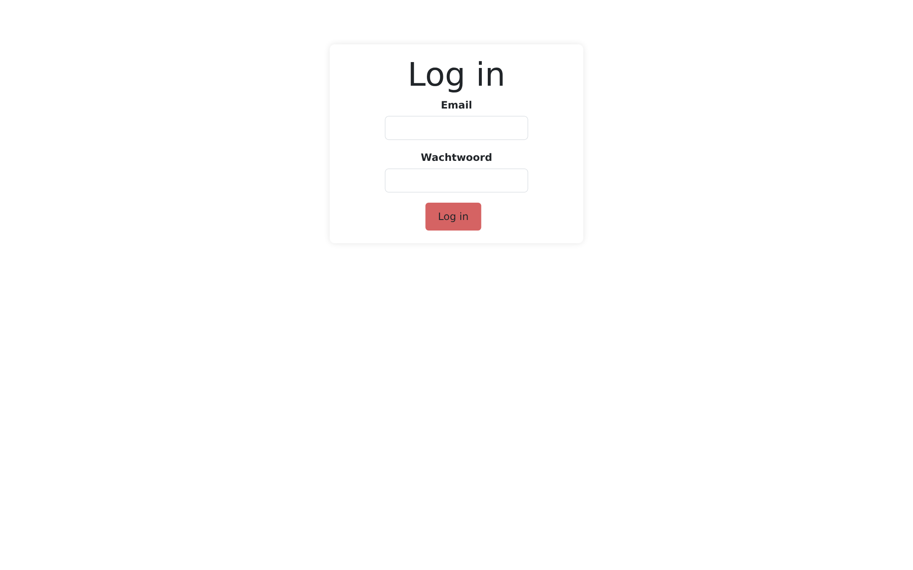

---

### 2. Interactive KPI Dashboard
Technicians and users have access to an interactive analytics dashboard with real-time KPI graphs powered by Recharts (line charts, bar charts, radial diagrams).

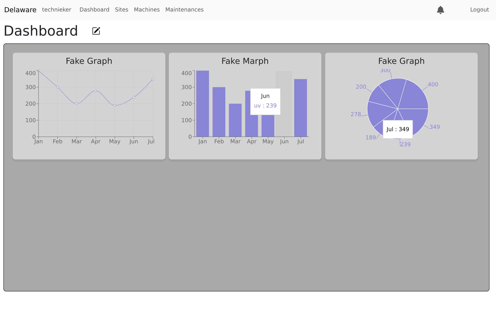

#### Custom Dashboard Grid & KPI Selection
Users can enter edit mode to dynamically drag, reorganize, add, or remove KPI widgets to personalize their dashboard layout.

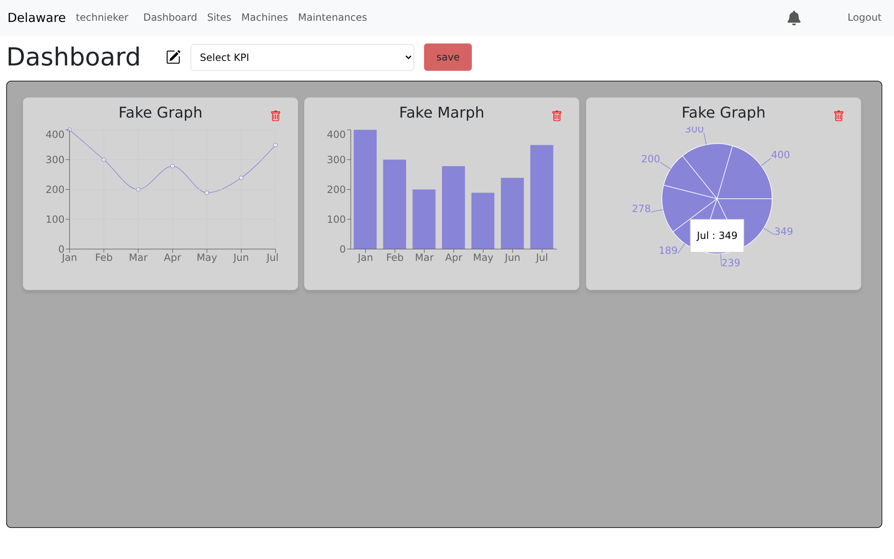

---

### 3. Machinery Fleet Monitoring & Management
Monitor all industrial machinery across production sites with quick search and status filtering (operational states, production status, site affiliation).

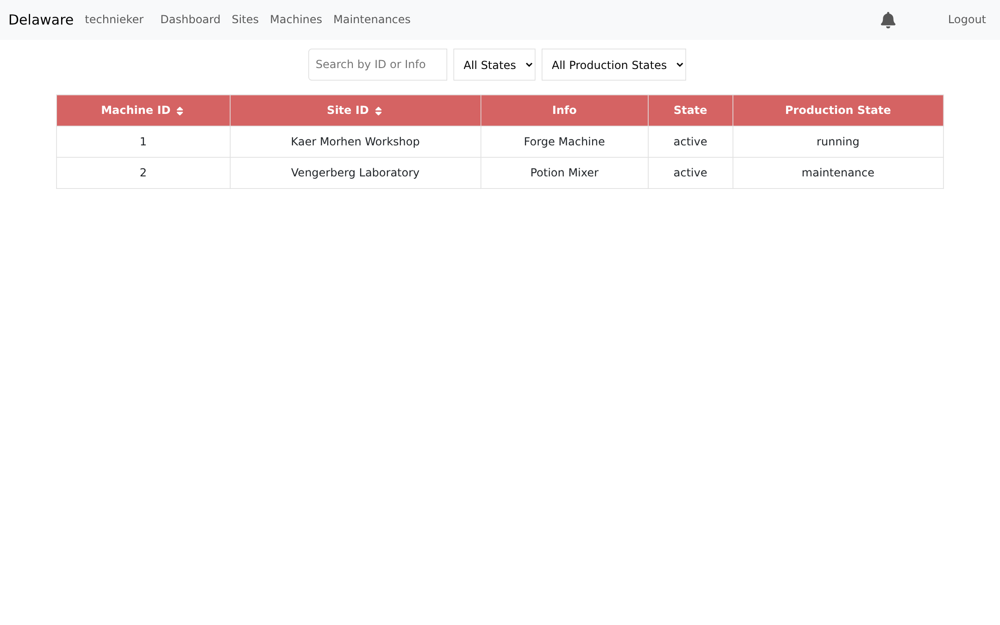

#### Machine Telemetry & Maintenance History
Detailed view of individual machines displaying operational health, uptime in hours, days since last maintenance, location, and quick actions to view maintenance records or schedule a new service.

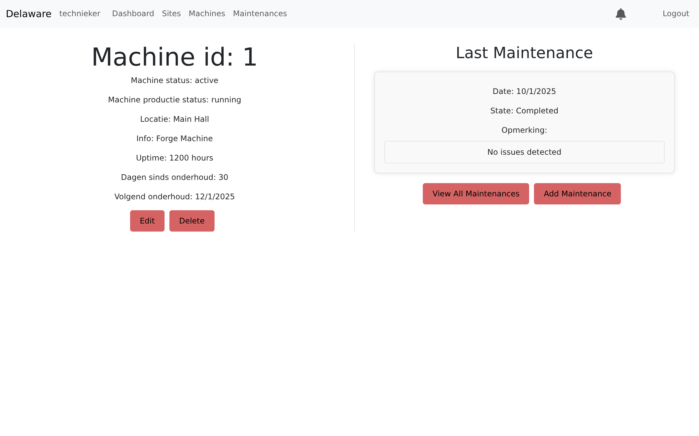

#### Asset Provisioning Form
Add new machinery assets to the fleet with location specifications and assigned technician details.

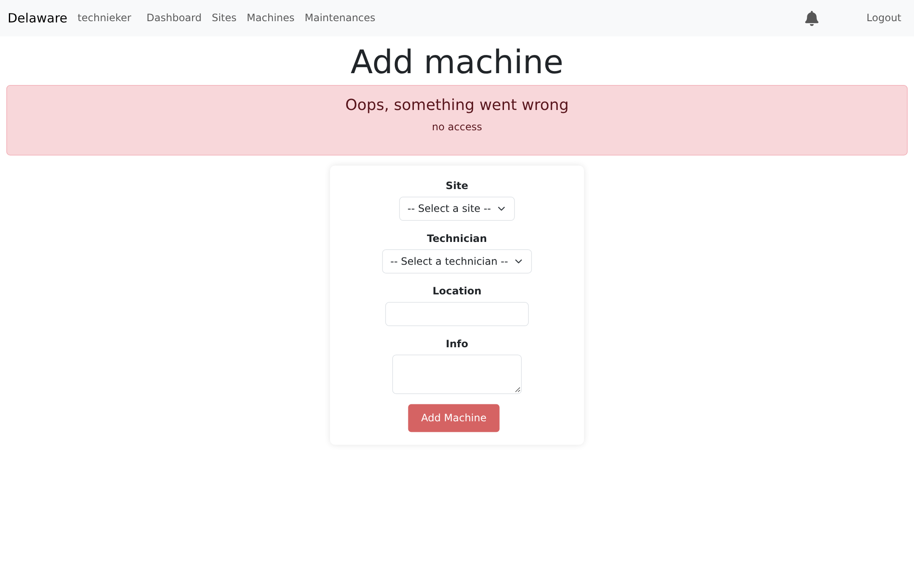

---

### 4. Maintenance Work Orders & Inspection Reports
Track scheduled, ongoing, and completed maintenance interventions across all facility equipment.

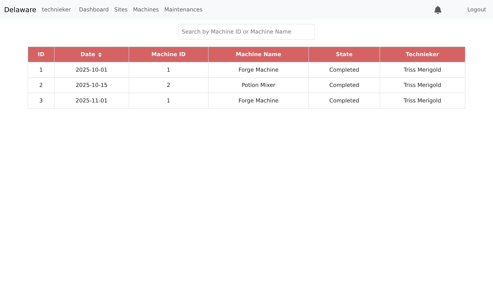

#### Inspection Report & Work Order Details
Review full inspection reports, time duration (start and end times), technician notes, and status for any maintenance intervention.

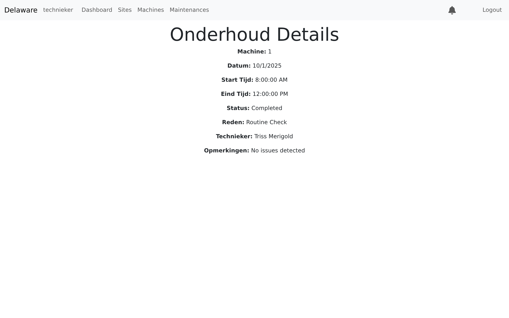

#### Maintenance Task Scheduling
Schedule preventative or corrective maintenance work orders with specified dates, time windows, and task reasons.

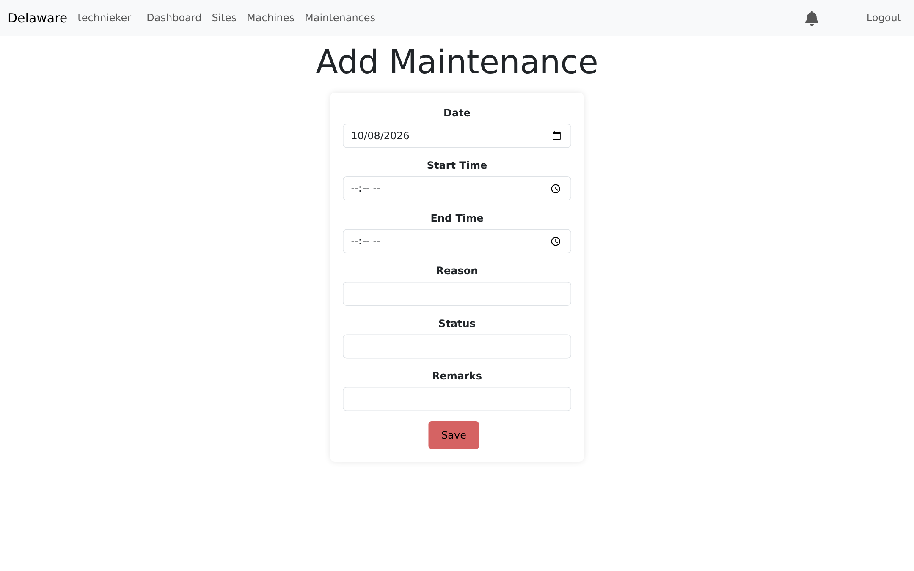

---

### 5. Real-Time Notifications & Alerts
In-app notification system alerting technicians and managers about new maintenance tickets, high-temperature alerts, and equipment status changes.

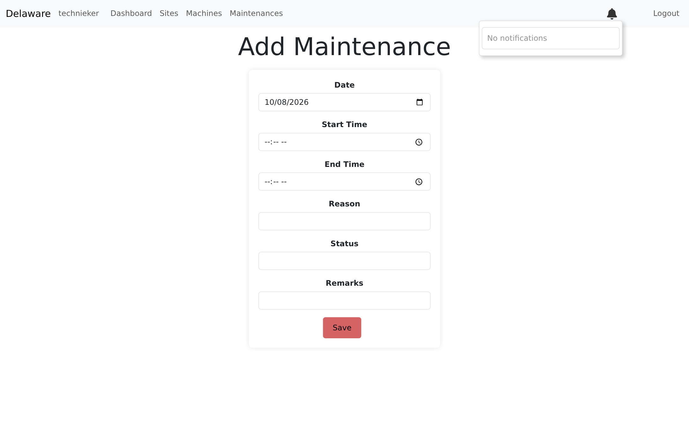

---

### 6. Admin User Management & Access Control
Administrators have access to a user management directory with search and role filters to manage team permissions across the organization.

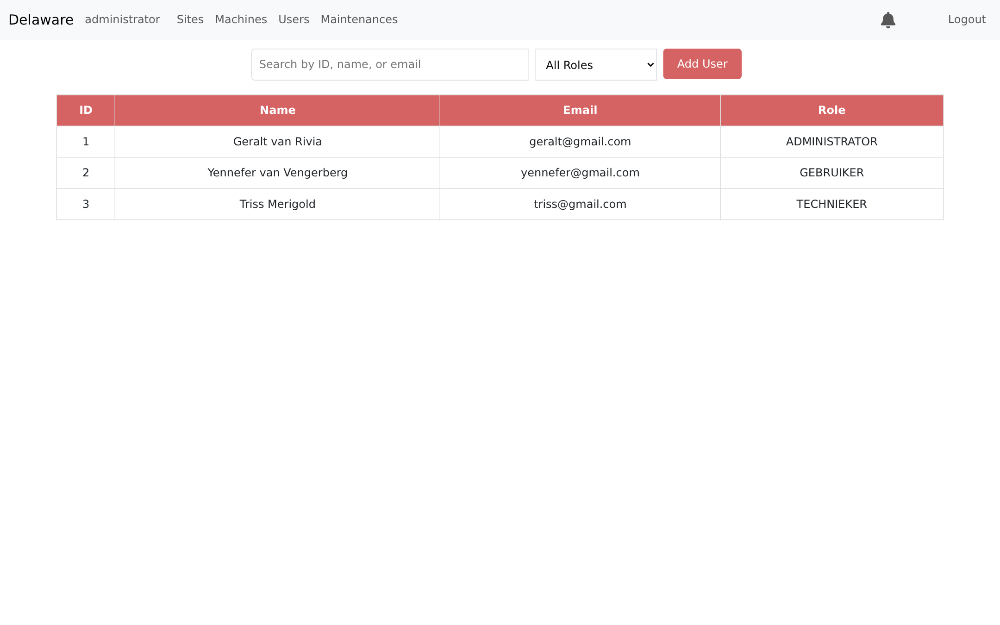

#### User Onboarding & Registration Form
Register new personnel with role assignment (`ADMINISTRATOR`, `TECHNIEKER`, `GEBRUIKER`, `MANAGER`, `VERANTWOORDELIJKE`), address details, and account credentials.

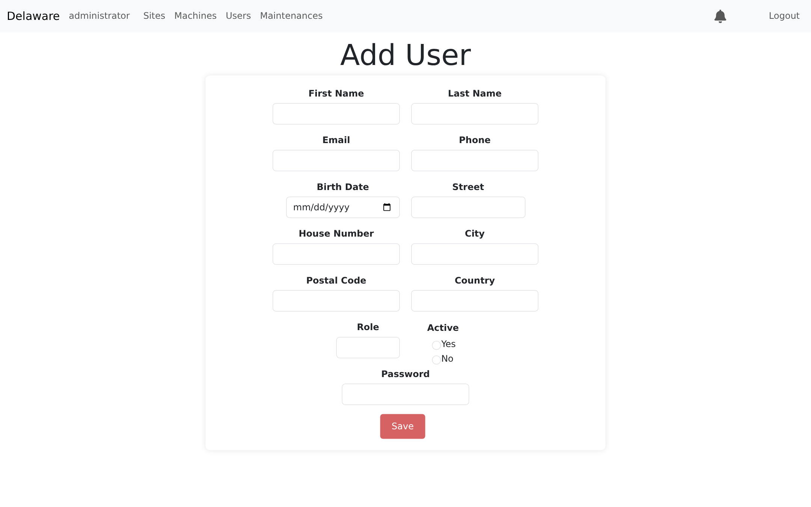

---

### 7. Production Facility & Site Management
Administrators and managers can manage facilities and production sites, displaying responsible managers and associated machine counts.

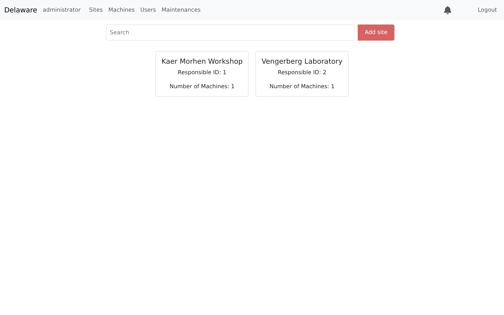

#### Site Breakdown & Associated Machinery
Detailed site view showing site manager information and a listing of all machinery operating at that location.

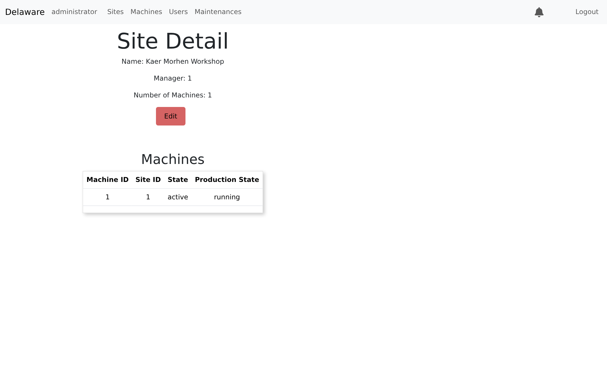

---

## Project Architecture

```
                                      ┌────────────────────────┐
                                      │  React Web Application │
                                      │      (Port 5173)       │
                                      └───────────┬────────────┘
                                                  │ HTTP / REST
                                                  ▼
                                      ┌────────────────────────┐
                                      │  Node.js / Koa Backend │
                                      │      (Port 9000)       │
                                      └───────────┬────────────┘
                                                  │ Prisma ORM
                                                  ▼
┌────────────────────────┐            ┌──────────────────────────────┐
│  JavaFX Desktop App    │  ──JDBC─▶  │        MySQL Database        │
│      (sdp2-java)       │            │   (Port 3307 internal:3306)  │
└────────────────────────┘            └──────────────────────────────┘
```

1. **[2025-react-gent13](./2025-react-gent13)**: Frontend web application built with React 19, Vite, React Router, Recharts, and React Bootstrap.
2. **[2025-nodejs-gent13](./2025-nodejs-gent13)**: REST API backend built with Node.js, Koa, TypeScript, Prisma ORM, and Argon2 password hashing.
3. **[2025-java-gent13](./2025-java-gent13)**: Desktop management client built with Java 21, JavaFX, and JPA / EclipseLink.
4. **MySQL Database**: Central database storing users, sites, machines, maintenance records, and notifications.

---

## Running with Docker / Podman (Zero Local Installation)

Run the entire application stack in isolated containers without installing Node, Yarn, Java, or MySQL on your host system:

```bash
docker compose up -d
# or using podman-compose:
podman-compose up -d
```

### Accessing the Applications

| Component | URL | Description |
|---|---|---|
| **Frontend** | [http://localhost:5173](http://localhost:5173) | Web Dashboard and Management UI |
| **Backend API** | [http://localhost:9000](http://localhost:9000) | REST API |
| **Health Ping** | [http://localhost:9000/api/health/ping](http://localhost:9000/api/health/ping) | Backend Health Check |
| **MySQL DB** | `localhost:3307` | Database (`root` / `root`, DB: `Local_SDP2`) |

*(Note: MySQL is exposed on host port `3307` by default to avoid conflicts if another MySQL instance is already running on port 3306).*

### Stopping the Stack

```bash
docker compose down
# or
podman-compose down
```

---

## Default Seeded Accounts

The database is automatically initialized and seeded on first startup with the following test credentials:

| Email | Password | Role | Primary Views |
|---|---|---|---|
| `geralt@gmail.com` | `12345678` | **Administrator** | Users Directory, Add User, Sites Overview, Site Details |
| `triss@gmail.com` | `12345678` | **Technieker** | KPI Dashboard (Customizable), Machines Fleet, Maintenances, Add Maintenance |
| `yennefer@gmail.com` | `12345678` | **Gebruiker** | Dashboard, Machinery Overview |
